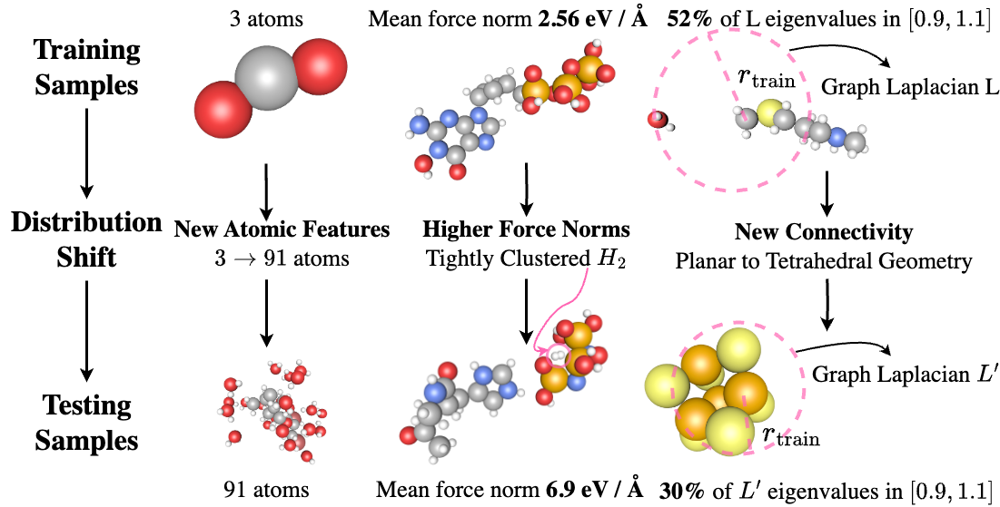

# Understanding and Mitigating Distribution Shifts for Machine Learning Force Fields
[](https://doi.org/10.5281/zenodo.17401634)




This repository provides implementations for test-time training and test-time radius refinement for machine learning force fields (MLFFs). This repository is largely based off of [this repo](https://github.com/kyonofx/MDsim/tree/main). We also release our specific data splits for our MLFF distribution shifts benchmarks to help evaluate the next generation of MLFFs.

[[paper]](https://pubs.rsc.org/en/Content/ArticleLanding/2026/DD/D5DD00260E)
[[website]](https://tkreiman.github.io/projects/mlff_distribution_shifts/)

If you find this work useful, please consider citing:

```
@article{Kreiman2026,
  title = {Understanding and mitigating distribution shifts for universal machine learning interatomic potentials},
  volume = {5},
  ISSN = {2635-098X},
  url = {http://dx.doi.org/10.1039/D5DD00260E},
  DOI = {10.1039/d5dd00260e},
  number = {1},
  journal = {Digital Discovery},
  publisher = {Royal Society of Chemistry (RSC)},
  author = {Kreiman,  Tobias and Krishnapriyan,  Aditi S.},
  year = {2026},
  pages = {415–439}
}
```

## Installation

To install the dependencies for this project, run the following command (conda should also work but mamba is recommended):

```
mamba env create -f env.yml
pip install -e ./
```
If there are issues with the installation, it can be  helpful to first individually install [pytorch](https://pytorch.org/get-started/locally/) and [torch geometric](https://pytorch-geometric.readthedocs.io/en/latest/install/installation.html) before installing the rest of the dependencies.

## Benchmarks and Data Processing

```.xyz``` files containing the benchmarks can be found [here](https://drive.google.com/file/d/1u15bRsrOrERb4WSMfNP-T4jsAiFFNQeb/view?usp=sharing) or on [huggingface](https://huggingface.co/datasets/tkreiman/mlff_distribution_shifts/tree/main). This contains the SpiceV2 distribution shift benchmark, the data for the force norm distribution shifts on MD22, and the data used to train the models for the simulation benchmark on MD17.

Once the xyz files are downloaded, they can be processed into lmdb format with ```preprocessing/xyz_to_lmdb.py```. For instance, 
```
python preprocessing/xyz_to_lmdb.py --db_path data/md17_ood_sim/lmdb --xyz_path data md17_ood_sim/md17_aspirin_benzene_uracil_train.xyz --split_name train
``` 
The prior can also be added to the dataset by passing in ```--calc-classical```. By default, the prior is sGDML. This requires having an sGDML prior trained. For md17, these can be obtained [here](http://sgdml.org/). The code can be easily modified to use a different ase calculator for a new prior. 

**Remember to modify the data paths in the configs folder appropriately.**

## Training and Simulation

Training happens through ```main.py```. Simply pass in a config like so:
```
python main.py --mode train --config-yml configs/md17_multi/gemnet-dT.yml --identifier <run_name>
```

Finetuning can be done by passing in a checkpoint with the ```--checkpoint MODELPATH/<run_name>/checkpoints/best_checkpoint.pt``` parameter and passing ```--finetuning=True```. Additionally, parts of the model can be frozen during fine-tuning with 
```
--freeze_rep=True
--freeze_amount=[max, med, min]
```   
For more details, see [the original MDsim repo]((https://github.com/kyonofx/MDsim/tree/main)), or [the fairchem documentation](https://github.com/FAIR-Chem/fairchem).

Simulations can be run similarly:
```bash
python simulate.py --config_yml configs/simulate/naphthalene.yml --model_dir MODELPATH/<run_name>/
```
## Test-Time Training

Test-time training happens through `mdsim/trainers/ttt_trainer.py`. The actual code to implement TTT is quite simple and happens at the beginning of the validation loop:

```python
self.load_freeze_head()
self.train()
self.load_qm_head()
```
First, we load the head that predicts targets from the prior. We then train the representation parameters on the prior targets. We finally load the main task head before predicting on the test set.

For instance to run TTT on md17:
```
python main.py --mode validate --config-yml configs/md17_multi/gemnet-dT_ttt.yml --debug --checkpoint MODELPATH/<main_task_run_name>/checkpoints/best_checkpoint.pt --ttt_params.freeze_head_checkpoint=MODELPATH/<prior_task_run_name>/checkpoints/best_checkpoint.pt
```
Note that this requires having 2 checkpoints. The first checkpoint (`<prior_task_run_name>`) was trained on the prior targets. The second checkpoint (`<main_task_run_name>`) was fine-tuned from the prior task model on the main task (while keeping the representation frozen).Moreover, this requires passing in 2 dataset paths in the config. The dataset called `ttt_val_dataset_path` has the reference labels and is used to evaluate the model. The main dataset has both the reference and prior labels, and the prior labels are used to improve the representations of the model. See the paper for more details.

## Test-Time Radius Refinement

An example of test-time radius refinement with MACE-OFF can be found in `radius_refinement_maceoff.py`.

